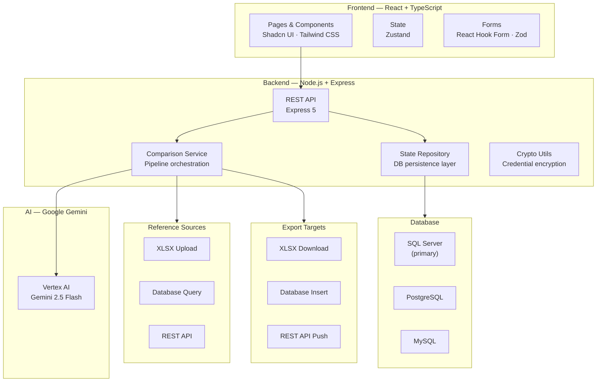
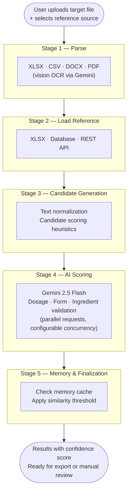

# 🧠 MAI — Matching & AI Intelligence

  
  
  
  
  
  

> O código-fonte é proprietário e confidencial. Este repositório serve como referência de portfólio.
> The source code is proprietary. This repository serves as a portfolio reference only.

---

Plataforma SaaS B2B para **comparação e matching inteligente de itens** usando IA. O caso de uso principal é reconciliação de catálogos farmacêuticos — cruzar produtos de diferentes fontes e identificar correspondências com validação de dosagem, forma farmacêutica e composição — mas a plataforma é agnóstica a domínio.

O usuário carrega um arquivo de referência e um arquivo alvo; a IA analisa, pontua candidatos e retorna os matches com nível de confiança, pronto para exportação.

### Funcionalidades

- **Pipeline de comparação com IA:** processamento em etapas — parse de arquivos (PDF, XLSX, CSV, DOCX), normalização de texto, geração de candidatos, scoring via Gemini e validação final
- **Memória de comparações:** cache de decisões anteriores para acelerar matches futuros sem custo de IA
- **Fontes de dados flexíveis:** catálogos carregados via XLSX, bancos de dados (SQL Server, PostgreSQL, MySQL) ou APIs REST
- **Exportação multicanal:** resultados exportados para XLSX, banco de dados (insert/append/replace) ou APIs externas
- **Multi-tenant com planos e cotas:** sistema de assinaturas com limites mensais por usuário, feature flags por plano e sub-cotas para times
- **Autenticação completa:** registro com verificação por e-mail, login com bcrypt, sessões httpOnly, convites por link e reset de senha

---

## 🏗️ Architecture

---

## 🔄 Comparison Pipeline

---

## 🛠️ Technology Stack

| Category | Technologies |
|---|---|
| **Frontend** | React 19 · TypeScript 6 · Vite · Tailwind CSS · Shadcn UI · Radix UI |
| **State Management** | Zustand · React Hook Form · Zod |
| **Charts** | Recharts |
| **Backend** | Node.js · Express 5 |
| **AI** | Google Gemini 2.5 Flash · Vertex AI · Gemini API |
| **Databases** | SQL Server · PostgreSQL · MySQL |
| **File Processing** | xlsx · pdf-parse · pdfjs-dist · mammoth (DOCX) |
| **Auth & Security** | bcryptjs · express-session · AES-256 encryption · rate-limiter-flexible |
| **Email** | nodemailer |
| **HTTP / APIs** | fetch · CORS · Multer (file upload) |
| **Architecture** | Multi-tenant SaaS · Subscription plans · Pipeline pattern · Memory cache · Multi-DB abstraction |

---

## 💳 Subscription Plans

A plataforma implementa um modelo de preços dinâmico baseado em uso real:

| Plano | Usuários | Comparações/mês | IA | Fontes DB/API |
|---|---|---|---|---|
| Gratuito | 1 | Limitado | — | — |
| Essencial | 1 | ✅ | ✅ | — |
| Profissional | 1 | ✅ | ✅ | ✅ |
| Empresarial | Time | ✅ | ✅ | ✅ |
| Corporativo | Ilimitado | ✅ | ✅ | ✅ |

---

## 👤 Author

**Gabriel Paulino**
- GitHub: [@gabrielborralhogomes](https://github.com/gabrielborralhogomes)
- LinkedIn: [gabrielborralho](https://www.linkedin.com/in/gabrielborralho)
- Email: gabrielborralho98@gmail.com

---

> *Este projeto é proprietário. Este repositório serve apenas como referência de portfólio.*
> *This project is proprietary. This repository serves as a portfolio reference only.*
